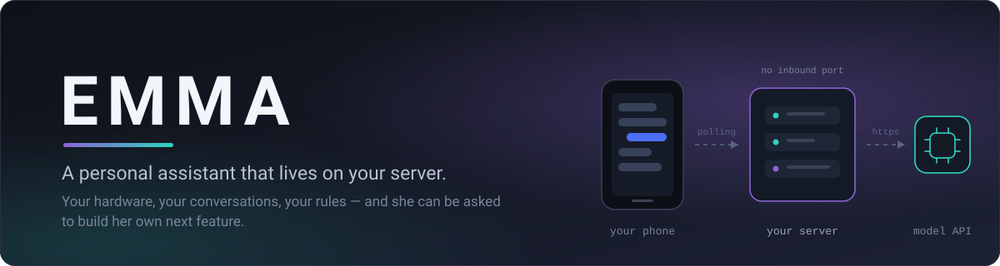
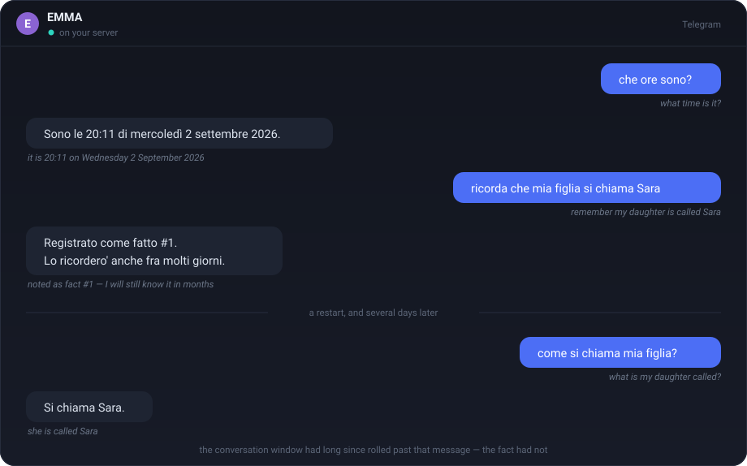
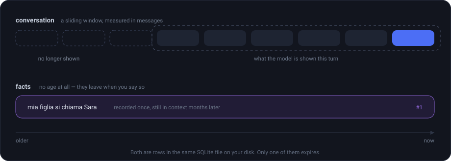
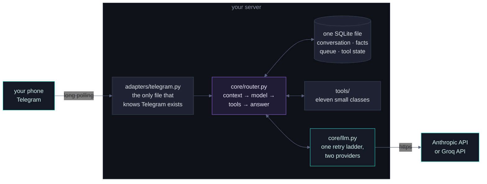
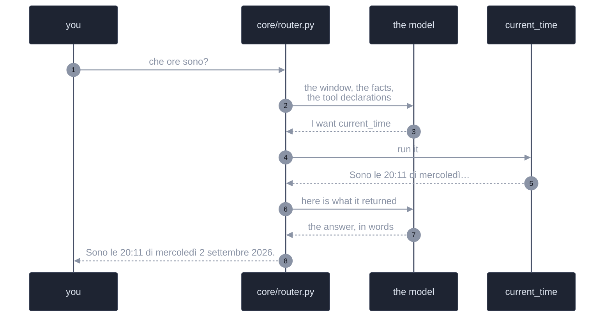

<div align="center">



<br>

[](https://www.python.org/)
[](LICENSE)
[](CHANGELOG.md)
[](#why-self-host-it)
[](#requirements)

</div>

---

## What it feels like

<div align="center">

</div>

She is configured in Italian here — the personality is a plain text file you can
rewrite in any language. Every reply is captured from the running assistant, not
written for this page.

<details>
<summary><b>The same exchange as text, and two more</b></summary>

<br>

```
you   che ore sono?                              (what time is it?)
EMMA  Sono le 20:11 di mercoledì 2 settembre 2026.

you   ricorda che mia figlia si chiama Sara      (remember my daughter is Sara)
EMMA  Registrato come fatto #1. Lo ricordero' anche fra molti giorni.
                                     (noted — I will still know this in months)

      … a restart, and days later, with the conversation window long since
        rolled past that message …

you   come si chiama mia figlia?                 (what is my daughter called?)
EMMA  Si chiama Sara.

you   quanti strumenti hai?                      (how many tools do you have?)
EMMA  Ho 11 strumenti: request_development, work_status, answer_question,
      abandon_development, running_version, remember_fact, forget_fact,
      current_time, remove_tool, enable_tool, list_tools.

you   sviluppo: aggiungi il meteo                (development: add a weather tool)
EMMA  Registrata come lavoro #1. Sara' presa in carico alla prossima sessione
      di sviluppo.
```

</details>

---

## Why self-host it

- **It is yours.** It runs on your hardware, and nothing about it is a product:
  no account to keep, no plan to renew, no terms that change under you. Two
  services see your messages in transit — Telegram, which carries them, and the
  model API, which answers them. Everything that is *kept* — the history, the
  facts, the queue — is one SQLite file on your own disk, which you can open
  with `sqlite3`; the logs are in your own journal.
- **Nothing is exposed.** Telegram long polling means no inbound port, no
  domain, no TLS certificate, no webhook to secure. The health endpoint listens
  on loopback only.
- **One user.** The bot answers the Telegram ID you whitelist and ignores
  everyone else, silently.
- **It tells you when it is unwell.** `/health` reports a database it cannot
  read and long polling that has quietly stopped — the two ways a chat bot can
  look alive and be deaf.
- **It can be asked to grow.** Tell her a capability is missing and she files it
  as a job in her own queue, which a development session then works through.
  The clock in the table below arrived that way — job #9 in that queue, because
  she had been asked the time and had no way to know it. Before that she
  guessed, which is always wrong.

---

## What she can do

Eleven tools, each a small class satisfying one protocol. Adding another means
writing that class and registering it in `main.py`: the router never changes,
and neither does anything else under `core/`.

| | Tool | For |
|---|---|---|
| 🕑 | `current_time` | the date and time where *you* are, not where the server is |
| 🧠 | `remember_fact` · `forget_fact` | facts that never expire, unlike the conversation window |
| 🔎 | `list_tools` · `running_version` | what she can do, and exactly which commit is running |
| 🛠 | `request_development` · `work_status` · `answer_question` · `abandon_development` | commissioning her own development, and following it |
| 🔌 | `remove_tool` · `enable_tool` | switching a tool off, and — on a second request, later — having it removed |

She has **two kinds of memory**, and the difference is the point. The
conversation is a sliding window that forgets by age; facts have no age at all,
so *"my daughter is called Sara"* stops dying at the same rate as *"what time is
it"*.

<div align="center">

</div>

---

## How it fits together



And this is one turn. The loop is the part a box diagram cannot show: the
model may ask for a tool, read what it returns, and ask for another, up to a
bounded number of rounds before it has to answer in words.



**One rule holds the shape:** nothing under `core/` knows that Telegram, or any
tool, exists. The adapter speaks Telegram, the router speaks protocols, and a
tool is anything with a name, a description, a schema and a `run()`. That is
why a second channel — the voice satellite on the roadmap — is a new adapter
rather than a rewrite.

---

## Requirements

- **Python 3.11+** (3.12 supported; tested on Ubuntu 24.04)
- A **Telegram bot token** from [@BotFather](https://t.me/BotFather) and your
  numeric user ID (ask [@userinfobot](https://t.me/userinfobot))
- **One** LLM backend:
  - [Anthropic API key](https://console.anthropic.com) — `LLM_PROVIDER=anthropic` (default)
  - [Groq API key](https://console.groq.com) — `LLM_PROVIDER=groq`, free tier is enough to run this
- Linux, macOS or Windows to develop; the deployment guide targets Ubuntu Server

---

## Quick start

```bash
git clone https://github.com/<your-account>/emma.git
cd emma

python3 -m venv .venv
source .venv/bin/activate          # Windows: .venv\Scripts\activate
pip install -r requirements.txt

cp .env.example .env               # fill in the three required values
chmod 600 .env

python main.py
```

Write to your bot from Telegram: an answer arrives in a second or two, with the
log line for it on stdout.

Everything else has a sensible default and is documented in `.env.example`. If a
required value is missing, the process refuses to start and names it — rather
than failing on your first message hours later.

> **For a real deployment** — dedicated system user, systemd unit, automatic
> restart, nightly backups with integrity checks, and a tested restore — follow
> **[`docs/GUIDA.pdf`](docs/GUIDA.pdf)**, which takes a fresh Ubuntu Server to a
> running assistant in about an hour. This README is the short version of it.

---

## Repository layout

```
main.py                 entry point: FastAPI health endpoint + Telegram, one event loop
config.py               .env loading and validation — refuses to start on a bad value

adapters/telegram.py    the only file that knows Telegram exists

core/router.py          orchestrator: context → model → tool loop → answer
core/llm.py             Anthropic and Groq clients behind one retry ladder
core/memory.py          conversation history (SQLite), with self-repair
core/tasks.py           the development queue she commissions work into
core/version.py         which commit is actually running, and whether it drifted
core/retry.py           the backoff policy, stated once

tools/facts/            facts that do not expire
tools/clock.py          the time where you are
tools/development.py    commissioning and following her own development
tools/introspection.py  version and tool inventory
tools/toolstate/        switching a tool off, and two-stage removal

prompts/                the personality, as plain text you can rewrite
scripts/                backup, deploy, and the queue watcher
systemd/                service and backup timer
tests/                  490 tests, none of which touch the network
docs/GUIDA.md/.pdf      full deployment and maintenance manual
docs/img/               the diagrams on this page, hand-written SVG
CLAUDE.md               standing rules for AI assistants working on this repo
REVISIONE.md            design review: what was rejected, and why
```

Everything written here is in English. Two things are deliberately not, and
both are the product rather than documentation: `prompts/system_prompt.txt`,
which is EMMA's personality, and the strings her tools return — she speaks
Italian to the person she belongs to, and that is a configuration choice you can
change by rewriting one text file.

---

## Development

```bash
ruff format .        # formatter
ruff check .         # linter — must pass clean
pytest               # 490 tests, no network at any point
```

The suite never touches the network: the model is a scripted fake implementing
the same interface as the real client, and the two provider clients are tested
from one shared description — they drifted apart once, and the cost was a
release where the tools were silently never offered.

---

## Roadmap

Each phase lands on the foundation the previous one left:

- **v0.1 — text.** Telegram, agentic router, in-memory context.
- **v0.2 — persistence.** SQLite behind `ConversationMemory`, so conversations
  survive a restart.
- **v0.3 — tools.** The `Tool` protocol stops being theory. The first set is the
  one that lets EMMA ask for the others: she can commission her own development,
  and report which version of herself is running.
- **v0.4 — memory and self-knowledge** *(this release)*. Facts that do not
  expire, a clock, an inventory of her own tools, and a two-stage way to switch
  one off and later have it removed.
- **v0.5 — voice.** A Raspberry Pi satellite with wake word, speech-to-text and
  text-to-speech, talking to the same core through a new adapter.

The numbers describe what shipped, not what was planned: v0.3 was going to be
calendar, notes, home automation and web search, and turned out to be the tools
EMMA needed in order to be developed at all. Reserving a number for a feature
nobody has built yet is how a roadmap ends up disagreeing with the release
printed beside it.

---

## Contributing

Bug reports, questions and pull requests are welcome — see
[CONTRIBUTING.md](CONTRIBUTING.md). One house rule: architectural changes are
discussed in an issue before they are implemented, and the reasoning goes in
[`REVISIONE.md`](REVISIONE.md) whether or not the change is made.

## Authorship

Written by a human author and Claude, working together. The design decisions,
the reviews and the arguments behind them are recorded in `REVISIONE.md` —
including the ones that were rejected, which are usually the more interesting
half.

## License

[MIT](LICENSE).
